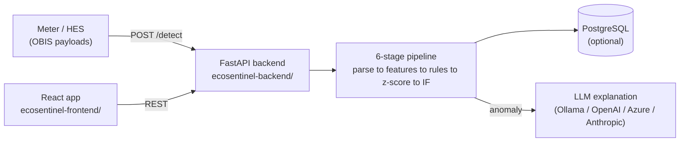

# EcoSentinel — Smart Meter Anomaly Detection

EcoSentinel is a full-stack system that detects anomalies in smart-meter telemetry. It ingests raw
DLMS/COSEM meter payloads (pipe-delimited OBIS readings), runs a **6-stage detection pipeline**
(parsing → feature engineering → rule-based → statistical → machine-learning), and can generate a
**plain-language explanation** of each flagged anomaly using an LLM. A React web app lets you submit
readings, inspect the layered detection results, and read the AI explanations.

- **Backend:** Python + FastAPI + scikit-learn (Isolation Forest), PostgreSQL (optional), LLM via
  [LiteLLM](https://github.com/BerriAI/litellm) (Ollama by default; OpenAI/Azure/Anthropic supported).
- **Frontend:** React 18 + TypeScript + Vite + Tailwind + Radix UI + Zustand.

> **Looking for the deep technical + strategic reference?** See
> [`docs/project-explanation/`](docs/project-explanation/README.md) — a code-grounded walkthrough of
> the architecture, model design, known limitations, scaling, and roadmap.

---

## Table of contents

1. [What it does](#what-it-does)
2. [Architecture at a glance](#architecture-at-a-glance)
3. [Prerequisites](#prerequisites)
4. [Quick start (detection only, no database)](#quick-start-detection-only-no-database)
5. [Full setup (with database + AI explanations)](#full-setup-with-database--ai-explanations)
6. [Running the frontend](#running-the-frontend)
7. [Trying it out / testing](#trying-it-out--testing)
8. [API reference](#api-reference)
9. [Configuration](#configuration)
10. [Project structure](#project-structure)
11. [Troubleshooting](#troubleshooting)

---

## What it does

Each meter reading is pushed through six sequential stages:

| # | Stage | What it does |
|---|-------|--------------|
| 1 | **OBIS Parser** | Splits the pipe-delimited `rawValue` string into structured readings |
| 2 | **Canonical Mapper** | Maps OBIS codes → canonical names (`voltage`, `energy_consumption`, …) |
| 3 | **Feature Engineer** | Computes rolling stats and time-normalized features from the reading + history |
| 4 | **Rule-Based** | Deterministic checks (negative energy, voltage out of range, invalid PF, …) |
| 5 | **Z-Score** | Statistical deviation from the meter's recent baseline |
| 6 | **Isolation Forest** | ML model, routed to one of 6 per-meter-type models or a global fallback |

A reading is flagged as an **anomaly if any layer fires**. When an anomaly is flagged (and a database
+ LLM are configured), a background task generates a structured, human-readable explanation that the
frontend can poll for.

**Supported meter types (capability groups):** the system handles meters that expose different subsets
of parameters — from energy-only meters to full metering stations (energy, voltage, current, power
factor, apparent/export energy, frequency). See
[`docs/project-explanation/01-current-state.md`](docs/project-explanation/01-current-state.md) for the
full matrix.

---

## Architecture at a glance



The HTTP layer is stateless; meter history lives in PostgreSQL and is fetched per request. **The
database and the LLM are both optional** — without them, rule-based and ML detection still run (with
reduced statistical quality and no persisted explanations).

---

## Prerequisites

| Tool | Version | Needed for |
|------|---------|-----------|
| **Python** | 3.10+ | Backend |
| **Node.js** | 18+ (with npm) | Frontend |
| **PostgreSQL** | 13+ | History-based features, persistence, AI explanations (optional) |
| **Ollama** | latest | Local LLM explanations (optional; or use a cloud provider) |
| **Git** | any | Cloning |

You can run **detection-only** with just Python + Node. PostgreSQL and Ollama unlock the statistical
layer's full strength and the AI explanations respectively.

---

## Quick start (detection only, no database)

This gets the API and UI running with rule-based + ML detection. (Statistical/history features and AI
explanations require the [full setup](#full-setup-with-database--ai-explanations).)

```bash
# 1. Clone
git clone https://github.com/CodeWithMrunal/EcoSentinel.git
cd EcoSentinel

# 2. Python environment + dependencies
python -m venv .venv
# Windows:       .venv\Scripts\activate
# macOS/Linux:   source .venv/bin/activate
pip install -r requirements.txt

# 3. Generate synthetic training data, then train the models
cd ecosentinel-backend
python dataset/generate_dataset.py      # writes dataset/dynamic_meter_anomaly_dataset.csv
python training/train.py                # writes models/ (gitignored)

# 4. Start the API (from ecosentinel-backend/)
uvicorn api.main:app --host 0.0.0.0 --port 8000 --reload
```

The API is now at **http://localhost:8000** (interactive docs at **http://localhost:8000/docs**).

> **Important:** run the Python/uvicorn commands from inside `ecosentinel-backend/`. The `models/`
> directory and the dataset CSV are gitignored, so **you must run step 3 before the API will work** —
> the service loads model artifacts on startup.

Verify it's up:

```bash
curl http://localhost:8000/health
```

Then start the [frontend](#running-the-frontend).

---

## Full setup (with database + AI explanations)

### 1. Set up PostgreSQL

Create a database and user:

```sql
CREATE DATABASE meter_anomaly;
CREATE USER meter_user WITH PASSWORD 'meter_pass';
GRANT ALL PRIVILEGES ON DATABASE meter_anomaly TO meter_user;
-- then connect to the DB and grant schema rights:
\c meter_anomaly
GRANT USAGE, CREATE ON SCHEMA public TO meter_user;
```

The tables are created automatically on API startup (from `db/schema.sql`).

### 2. Configure environment variables

Create a `.env` file in `ecosentinel-backend/` (loaded automatically via `python-dotenv`):

```dotenv
# Database (required for history, persistence, explanations)
DB_HOST=localhost
DB_PORT=5432
DB_NAME=meter_anomaly
DB_USER=meter_user
DB_PASSWORD=meter_pass          # no default — must be set

# LLM / Decision engine (defaults shown; all optional)
LLM_PROVIDER=ollama
LLM_MODEL=llama3.1:8b
LLM_API_BASE=http://localhost:11434
DECISION_ENGINE_ENABLED=true
```

To use a cloud LLM instead of Ollama, change the provider block, e.g.:

```dotenv
LLM_PROVIDER=openai
LLM_MODEL=gpt-4o-mini
LLM_API_KEY=sk-...
```

(Anthropic and Azure are also supported — see the comments in `config/settings.py`.)

### 3. Set up the local LLM (Ollama)

Only needed if `LLM_PROVIDER=ollama`:

```bash
# Install Ollama from https://ollama.com, then:
ollama pull llama3.1:8b
ollama serve        # usually runs automatically as a background service
```

### 4. Generate data, train, and run

Same as quick-start steps 3–4:

```bash
cd ecosentinel-backend
python dataset/generate_dataset.py
python training/train.py
uvicorn api.main:app --host 0.0.0.0 --port 8000 --reload
```

On startup the API loads the models, verifies/creates the DB schema, and begins serving. Confirm both
components are healthy:

```bash
curl http://localhost:8000/health
# → {"status":"ok","components":{"model_artifacts":"ok","database":"ok"}, ...}
```

---

## Running the frontend

```bash
cd ecosentinel-frontend
npm install
cp .env.example .env          # ensure VITE_API_BASE_URL=http://localhost:8000
npm run dev                   # dev server at http://localhost:5173
```

Open **http://localhost:5173**. The app has three pages:

- **/detect** — build a meter payload and run detection; view per-layer results.
- **/explain** — enter an anomaly ID and poll for the AI explanation.
- **/ops** — health check, model info, and model hot-reload.

> The backend only allows CORS from `http://localhost:5173` by default. If you serve the frontend
> elsewhere, update `allow_origins` in `ecosentinel-backend/api/main.py`.

Other frontend scripts: `npm run build` (production bundle), `npm run preview` (serve the build),
`npm run lint`.

---

## Trying it out / testing

There is no automated test suite; testing is manual. The repo ships curated example payloads in
[`test_data_payloads.json`](test_data_payloads.json) covering normal readings and every anomaly type,
per meter group.

The statistical/ML layers need **baseline history** to be meaningful. If you have PostgreSQL
configured, seed a clean 48-hour baseline for the test meters first (a fresh meter with no history
won't trigger the statistical layer):

```bash
cd ecosentinel-backend

# Seed baseline history for the group_A test meters, ending just before the test timestamp
python utils/seed_normal_history.py \
  --meter SE2303001 SE2303062 SE2303064 \
  --group group_A --hours 48 --before "2026-06-18 10:00:00"
```

`test_data_payloads.json` lists the seeding commands for every group at the top of the file. Then send
a payload:

```bash
# A normal reading (should pass all layers)
curl -s -X POST http://localhost:8000/detect \
  -H "Content-Type: application/json" \
  -d '{"records":[{"id":50001,"meterSerial":"SE2303001","timestamp":"2026-06-18T10:00:00+00:00","obisCode":"1.0.99.1.0.255","entryId":1,"rawValue":"1,0.0.1.0.0.255,2,2026-06-18 10:00:00,|2,1.0.12.27.0.255,2,229.8,V|3,1.0.1.29.0.255,2,350.0,Wh|4,1.0.11.27.0.255,2,3.31,A|5,1.0.13.27.0.255,2,0.92,"}]}'
```

If a reading is flagged and the decision engine is enabled, the response includes an `anomaly_id` —
poll `GET /anomalies/{anomaly_id}/explanation` (or use the **/explain** page) for the AI explanation.

Useful reset utility during testing:

```bash
python utils/reset_db.py --all          # clear all tables (dev/test only)
python utils/reset_db.py --meter SE2303001
```

---

## API reference

| Method & path | Description |
|---------------|-------------|
| `POST /detect` | Run detection on a batch of meter records; returns per-record, per-layer results |
| `GET /health` | Service + model-artifact + database status |
| `GET /model/info` | Feature schema, detection thresholds, artifact paths |
| `POST /model/reload` | Hot-reload model artifacts after retraining (no restart needed) |
| `GET /anomalies/{id}/explanation` | Fetch/poll the LLM explanation for a flagged anomaly |

Interactive OpenAPI docs are always available at **http://localhost:8000/docs**.

**After retraining models**, apply them without restarting:

```bash
python training/train.py
curl -X POST http://localhost:8000/model/reload
```

---

## Configuration

Everything tunable lives in **`ecosentinel-backend/config/settings.py`** — the single source of truth
for the OBIS code registry, capability groups, feature schema, detection thresholds, rolling-window
size, and LLM/decision-engine settings. Environment variables override the DB and LLM settings (see the
`.env` example above).

To add support for a **new OBIS code** or a **new meter type**, start in `config/settings.py`. See
[`docs/project-explanation/03-meter-types-and-3phase.md`](docs/project-explanation/03-meter-types-and-3phase.md)
for the exact steps (and current caveats).

---

## Project structure

```
EcoSentinel/
├── README.md                     ← you are here
├── requirements.txt              ← Python dependencies (install from repo root)
├── test_data_payloads.json       ← example payloads + seeding commands
├── docs/project-explanation/     ← in-depth technical & strategic reference
│
├── ecosentinel-backend/
│   ├── api/                      ← FastAPI app + request/response schemas
│   ├── pipeline/                 ← the 6 detection stages
│   ├── decision_engine/          ← LLM explanation (provider-agnostic)
│   ├── config/settings.py        ← single source of truth for all config
│   ├── db/                       ← PostgreSQL schema + client
│   ├── dataset/generate_dataset.py  ← synthetic data generator
│   ├── training/train.py         ← trains all models
│   ├── utils/                    ← seed_normal_history.py, reset_db.py
│   └── models/                   ← trained artifacts (gitignored; created by train.py)
│
└── ecosentinel-frontend/
    └── src/                      ← React app (pages: detect / explain / ops)
```

---

## Troubleshooting

| Symptom | Likely cause & fix |
|---------|--------------------|
| `/health` shows `model_artifacts: missing`, or `/detect` errors on the IF layer | Models not trained — run `python dataset/generate_dataset.py` then `python training/train.py` from `ecosentinel-backend/` |
| `ModuleNotFoundError` when running scripts | Run backend commands from **inside `ecosentinel-backend/`**, with the virtualenv activated |
| Database shows `unavailable` in `/health` | Check PostgreSQL is running and the `DB_*` env vars (especially `DB_PASSWORD`, which has no default) |
| Detection runs but z-score never fires | The meter has no history — seed a baseline with `utils/seed_normal_history.py` (needs a database) |
| Explanation stays `pending` / `failed` | Ensure Ollama is running and the model is pulled (`ollama pull llama3.1:8b`), or configure a cloud provider in `.env` |
| Frontend can't reach the API / CORS error | Confirm `VITE_API_BASE_URL` in `ecosentinel-frontend/.env` and that the frontend runs on `http://localhost:5173` |

For a candid list of current limitations and known issues, see
[`docs/project-explanation/known-limitations.md`](docs/project-explanation/known-limitations.md).
</content>
