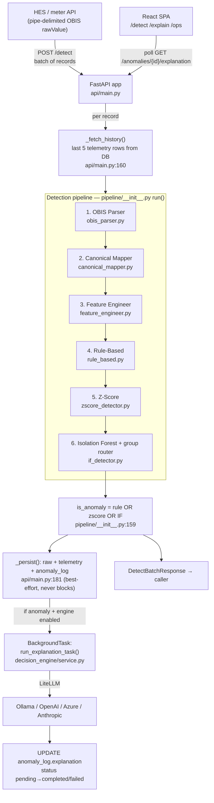

# 01 — Current State: What Exists and What It Handles Today

> **Scope of this file:** a precise, code-grounded walkthrough of EcoSentinel *as it exists in the
> repository right now* — the end-to-end flow, everything it handles, the business problem it
> addresses, and where the seams are. Correctness bugs are summarized here and detailed with
> `file:line` citations in [`known-limitations.md`](./known-limitations.md).
>
> Markers: ✅ Implemented & works · ⚠️ Partial / fragile / caveated · 🔲 Not built (recommendation).
> All paths are under `ecosentinel-backend/` unless noted. (Note: `CLAUDE.md`/root `README.md` use
> pre-refactor paths like `config/` at repo root; the real tree is `ecosentinel-backend/config/`.)

---

## 1. The business need it addresses

Electricity distribution utilities (DISCOMs) deploy **AMI** (Advanced Metering Infrastructure) —
smart meters that report interval consumption and power-quality data over DLMS/COSEM to a **Head-End
System (HES)**. Utilities lose 5–20%+ of energy to **non-technical losses** (theft, meter tampering,
CT bypass, billing faults) and suffer **power-quality events** (voltage sag/swell, PF collapse,
frequency excursions) that damage equipment and violate supply obligations.

EcoSentinel's proposition: take the raw HES meter stream, **flag anomalous readings in a way that is
explainable to operations staff**, and do it across meters that expose *different subsets of
parameters*. The differentiator versus a plain threshold alarm is (a) a layered detector that
combines hard rules, statistics, and ML, and (b) an **LLM "decision engine"** that turns a flagged
reading into a human-readable investigation note (what fired, why, plausible false-positive
scenarios, confidence). The intended user is a **utility operations analyst / revenue-protection
team** who needs triage, not raw scores.

**Today this is a working single-phase prototype** trained on synthetic data, validated manually
against curated payloads — not yet a production service (see §9 and the roadmap).

---

## 2. End-to-end flow (code-grounded)

The HTTP layer is **stateless**; all meter state lives in PostgreSQL and is re-fetched per request
(`README.md:107`). The DB is **optional** — if `psycopg2` import or the connection fails, detection
still runs with empty history (`api/main.py:82-95, 160-178`).

### Stage 1 — OBIS Parser ✅ · `obis_parser.py`
Splits the pipe-delimited `rawValue` string into `{interval_timestamp, readings{obis_code:{value,unit}}}`
(`parse_raw_value`, lines 96-162). Entry format is `seq,obis,attr,value,unit`; the clock object
`0.0.1.0.0.255` becomes the interval timestamp (lines 30-31, 135-136). Malformed entries **log a
warning and are skipped** rather than crashing (`_parse_entry`, lines 39-71). Raises `OBISParseError`
only if the timestamp entry or all measurements are missing (lines 144-153).

### Stage 2 — Canonical Mapper ✅ · `canonical_mapper.py`
Translates OBIS codes → canonical feature names using `OBIS_REGISTRY` as the single lookup
(`_OBIS_TO_CANONICAL`, lines 43-47). **Unknown OBIS codes produce a one-time warning and are dropped**
(lines 79-88) — they never break the pipeline but silently disappear (relevant to three-phase real
data, see [C4](./known-limitations.md)). Output canonical dict is what gets stored in
`meter_telemetry.raw_data` (JSONB).

### Stage 3 — Feature Engineer ⚠️ · `feature_engineer.py`
Computes the feature vector from the canonical dict + DB history. Key behaviours:

- **Energy is not required.** A "primary series" is chosen by priority
  `energy_consumption → current → voltage` (`PRIMARY_SERIES_PRIORITY`, lines 38-42); rolling stats
  are computed on whichever is first present.
- Emits time features (always), `delta`, `rolling_mean`, `rolling_std`, `z_score`, `spike_ratio`,
  `historical_avg_same_hour`, `historical_avg_same_day_type`, `voltage_deviation`,
  `power_factor_deviation`, `current_delta/_z_score/_spike_ratio`, and **`hourly_primary_ratio`**
  (lines 343-366). Missing inputs → `None`, then all `ALL_FEATURES` keys are backfilled to `None`
  (lines 369-371).
- ⚠️ **`hourly_primary_ratio` — the feature the IF was designed around — is near-constant `1.0` at
  inference** because same-hour history is unavailable in a 5-row window. This is the single most
  important correctness issue: [C1](./known-limitations.md).
- ⚠️ `NOMINAL_VOLTAGE = 230.0` and `holiday = Sunday` are hardcoded (lines 34, 45-46) — see
  [C11](./known-limitations.md).
- ⚠️ **`frequency` is never emitted** into the feature dict — see [C3.1](./known-limitations.md).

### Stage 4 — Rule-Based ✅ (mostly) · `rule_based.py`
Seven deterministic checks, each fires only when its feature is present:

| Rule | Condition | Violation ID | Threshold source |
|---|---|---|---|
| Negative energy | `energy < 0` | `negative_energy` | — |
| Zero flat-line | `energy == 0` AND `rolling_std < 0.01` | `zero_consumption` | hardcoded 0.01 |
| Voltage too low | `voltage < 180` | `voltage_too_low` | `DETECTION_CONFIG.voltage_min` |
| Voltage too high | `voltage > 270` | `voltage_too_high` | `DETECTION_CONFIG.voltage_max` |
| PF out of range | `pf < 0` or `pf > 1` | `power_factor_out_of_range` | `DETECTION_CONFIG.power_factor_min/max` |
| Negative current | `current < 0` | `negative_current` | — |
| Frequency abnormal | `freq < 49` or `> 51` | `frequency_out_of_range` | hardcoded (`rule_based.py:56-57`) |

⚠️ The frequency rule is **dead** because frequency never reaches the feature dict
([C3.1](./known-limitations.md)). PF collapse to 0.65 does **not** fire (0.0–1.0 bounds) — by design
it's meant to be an ML-only anomaly (`test_data_payloads.json:171-177`).

### Stage 5 — Z-Score ⚠️ · `zscore_detector.py`
Threshold checks on the primary series' `z_score` (|z| > 3.0, lines 93-104), `spike_ratio`
(> 4× or < 0.1×, lines 130-149, **energy-only**), and `same_hour_deviation` (> 0.40, lines 114-124).

- ⚠️ `same_hour_deviation` depends on same-hour history → effectively unreachable at inference
  ([C2](./known-limitations.md)).
- ⚠️ The raw rolling `z_score` on a 5-reading window is vulnerable to normal morning ramps
  ([C5](./known-limitations.md)); spike/drop-ratio triggers require `energy is not None`, so
  energy-less meters (group_V) get weaker statistical coverage.

### Stage 6 — Isolation Forest + group router ✅ (routing) / ⚠️ (efficacy) · `if_detector.py`
Routing (`_resolve_group`, lines 134-169): compute present *raw* canonical features (excluding
derived), then **exact match → smallest-superset subset match → global fallback**. The matched
group's model, scaler, and saved feature list are lazy-loaded and cached (`_load_group`, lines
176-203); the global fallback applies **median imputation** for missing features (`_run_global_model`,
lines 318-352). Response carries `model_used` and `features_used`.

- ⚠️ Efficacy is undercut by [C1](./known-limitations.md) (dead primary feature),
  [C3](./known-limitations.md) (group_D drops frequency/export), and
  [C5](./known-limitations.md) (7% contamination floor).
- Dead code: `_group_features_for` (lines 79-127) is never called at inference.

### Verdict, persistence, response ✅
`is_anomaly = rule OR zscore OR IF` (`pipeline/__init__.py:159-163`) — conservative, recall-maximizing.
`_persist` (`api/main.py:181-256`) writes raw reading, canonical telemetry (`flagged_anomalous` set to
the verdict), and — if anomalous — an `anomaly_log` row with `explanation_status="pending"`.
**Persistence failures are swallowed** and never affect the response (lines 253-254). ⚠️ The hot path
also does two *extra* history reads + baseline-logging passes per record (`api/main.py:392-420`),
doubling DB load ([C15](./known-limitations.md)).

### Async LLM explanation ⚠️ · `decision_engine/`
On an anomaly, a FastAPI `BackgroundTask` runs `run_explanation_task` (`api/main.py:432-443`): fetch
up to 20 history rows, assemble `AnomalyContext`, build a strict-JSON prompt (`prompt_builder.py`),
call the provider-agnostic LiteLLM client (`llm_client.py`), validate the JSON into
`AnomalyExplanation` (`schemas.py`), and `UPDATE anomaly_log`. Robustness features: JSON-fence
stripping (`service.py:_extract_json`), confidence normalization + list coercion validators
(`schemas.py:67-86`), retries + a `response_format` fallback for local models
(`llm_client.py:161-179`), and guaranteed `failed` marking so rows never hang on a *live* failure
(`service.py:274-299`). ⚠️ But tasks are **in-process and non-durable** — a restart orphans `pending`
rows forever ([C9](./known-limitations.md)).

---

## 3. What it handles today — inventory

### Meter capability groups ✅ (`config/settings.py:187-231`)

| Group | Raw canonical features | Typical meter |
|---|---|---|
| `group_A` | energy, voltage, current, power_factor | Standard residential 1φ |
| `group_B` | energy, apparent_import_energy, voltage | Apparent-energy meter |
| `group_C` | energy, current | Basic 2-param meter |
| `group_D` | energy, active_export_energy, apparent_import_energy, voltage, current, power_factor, frequency | Full metering station |
| `group_E` | energy | Minimal meter |
| `group_V` | voltage, current (no energy) | Power-quality meter |

Each group has its own trained IF model under `models/<group>/`, plus a global fallback. ⚠️ All six
are **single-phase**; no per-phase or 3φ group exists ([C4](./known-limitations.md)).

### OBIS codes recognized ✅ (13, `config/settings.py:70-162`)
Timestamp clock; active import/export energy; apparent import/export energy; reactive import/export
energy; active import/export power; voltage; current; power factor; frequency. ⚠️ Only **averaged,
single-phase** voltage/current codes are registered — there are **no per-phase codes**, so
three-phase meters (a stated future requirement) cannot be represented ([C4](./known-limitations.md)).

### Detection layers ✅
Rule-based (7 rules), z-score (3 trigger families), Isolation Forest (6 group models + global). Verdict
= OR.

### API endpoints ✅ (`api/main.py`)

| Endpoint | Purpose |
|---|---|
| `POST /detect` | Batch detection; returns per-record layer results + `anomaly_id`/`explanation_status` |
| `GET /health` | Model-artifact + DB status; echoes `llm_model`/`llm_provider` |
| `GET /model/info` | Feature schema, thresholds, rolling window, artifact paths |
| `POST /model/reload` | Hot-reload model artifacts after retraining |
| `GET /anomalies/{id}/explanation` | Poll for the async LLM explanation |

⚠️ No authentication/authorization on any of them ([C10](./known-limitations.md)).

### Database tables ✅ (`db/schema.sql`)
- `raw_meter_readings` — verbatim audit trail (PK = API id; `uq_raw_reading` on serial+entry+received).
- `meter_telemetry` — parsed canonical `raw_data` JSONB; `flagged_anomalous` excludes anomalies from
  baselines; `uq_telemetry_interval` per (serial, interval). Indexed incl. GIN on JSONB.
- `anomaly_log` — layer flags, `if_score`, `zscore_value`, `rule_violations`, `feature_snapshot`, and
  the LLM `explanation`/`explanation_status`/`explanation_error`. FK to telemetry.

⚠️ No operator-disposition column for feedback ([C13](./known-limitations.md)).

### Frontend ✅ (`ecosentinel-frontend/`, React 18 + Vite + TS + Zustand/Immer + Radix + Tailwind)
Three routed pages (`App.tsx`): `/detect` (build a payload from a group template, POST, view layered
results in technical or non-technical mode), `/explain` (enter an anomaly id, poll every 3s up to 20
attempts — `useExplanation.ts` + `POLLING_CONFIG`), `/ops` (health, model info, model reload). The
frontend mirrors backend capability groups and OBIS labels in `constants/config.ts`. ⚠️ Its
`LLM_MODEL_GROUPS` list contains a questionable `gemma4:latest` entry ([C14](./known-limitations.md)).

### Supporting tooling ✅
- `dataset/generate_dataset.py` — physics-based synthetic generator (see `04-...`).
- `training/train.py` — trains all group models + global; stratified 80/20; prints metrics.
- `utils/seed_normal_history.py` — plants clean baseline history so tests can fire (required workflow).
- `utils/reset_db.py` — truncate/clear tables for clean testing.

---

## 4. What the system is good at vs where it breaks down (honest summary)

**Genuinely solid ✅**
- Clean, single-source-of-truth config (`config/settings.py`) — adding an OBIS code or a capability
  group really is a one-file change plus retrain.
- Graceful degradation: missing DB, missing params, malformed entries, missing IF model — all handled
  without crashing.
- Provider-agnostic LLM layer with real hardening against flaky local-model JSON.
- Schema-on-read telemetry (`raw_data` JSONB) means new parameters don't need a migration.
- Per-group models are the right instinct for heterogeneous meters (avoids cross-group imputation
  noise).

**Breaks down / caveated ⚠️ (all detailed in [`known-limitations.md`](./known-limitations.md))**
- **C1** train/serve skew on `hourly_primary_ratio` — the ML layer's headline feature is inert at
  serving time.
- **C2** the same-hour z-score trigger can't fire in production.
- **C3 / C3.1** group_D ignores frequency & export; frequency anomalies are undetectable by *any*
  layer.
- **C4** single-phase-only design; three-phase (a stated future requirement) is unsupported.
- **C5** contamination 0.07 + OR-verdict + 5-row z-score → structural false-positive pressure.
- **C6/C7** cold-start blindness and baseline-freeze on sustained legitimate change.
- **C8/C9/C10/C11** serial batch loop, non-durable LLM tasks, no auth, hardcoded locality constants.

---

## 5. One-paragraph takeaway

EcoSentinel is a **well-structured single-phase prototype** with a genuinely good configuration/
routing design and a strong explainability story, trained and demonstrated entirely on synthetic
data. Its architecture is production-*shaped* but not production-*ready*: the ML layer's core feature
is broken at inference, an entire parameter (frequency) is undetectable, three-phase support (a
stated future requirement) does not exist, and the operational scaffolding (streaming ingestion, auth,
durable async work, feedback loop, drift monitoring) does not yet exist. The remaining files map each
of these gaps to a concrete path forward.
</content>
