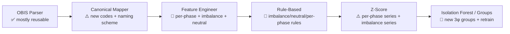

# 03 — Supporting Different Meter Types & Three-Phase Meters

> **Scope:** how the current single-source-of-truth config handles different parameters today, how to
> add new meter types, and — in depth — what must change for **three-phase (3φ)** meters, which the
> system was never built or tested for. For each pipeline stage this file flags **config-only** vs
> **net-new logic**. Markers: ✅ works today · ⚠️ partial/fragile · 🔲 not built.
> Backend paths under `ecosentinel-backend/`.

---

## 1. How the current design handles "different parameters" today ✅ / ⚠️

The system was explicitly built for **heterogeneous single-phase meters** — meters that expose
different *subsets* of the same parameter universe. Three mechanisms carry this:

1. **`OBIS_REGISTRY`** (`config/settings.py:70-162`) — the one place OBIS codes map to canonical
   names. Add an entry → the parser/mapper pick it up automatically (`canonical_mapper.py:43-47`).
2. **`CAPABILITY_GROUPS`** (`config/settings.py:187-231`) — each group is the *exact* set of canonical
   raw features a meter profile exposes. Routing matches a payload's present raw features to a group
   (`if_detector._resolve_group`).
3. **`DERIVED_FEATURE_MAP`** (`config/settings.py:288-317`) — declares which derived features each raw
   feature yields, so training and inference build feature lists identically.

**This works well for the "subset" axis** (a meter that sends {energy, current} vs one that sends the
full set). Adding a *new parameter within the single-phase averaged model* is close to config-only.

**Where it breaks down ⚠️:**
- The design assumes **one scalar per parameter** (one `voltage`, one `current`). Three-phase meters
  send **per-phase vectors** — a structural mismatch, not a subset (§3).
- `frequency` and `active_export_energy` are in a group definition but not wired into training
  features / feature-engineering ([C3](./known-limitations.md), [C3.1](./known-limitations.md)) —
  proof that "add to config and it just works" is **not fully true today**; the derived-feature and
  training feature-list code has per-parameter branches that must also be edited.
- Physical constants (`NOMINAL_VOLTAGE`, frequency bounds) are hardcoded, not per-type
  ([C11](./known-limitations.md)).

---

## 2. Adding a new single-phase parameter or meter type — the real steps

The docs claim "add one entry, nothing else changes." In practice, adding a **new raw parameter that
should influence detection** touches these files:

| Step | File | Config-only? |
|---|---|---|
| 1. Register the OBIS code → canonical name | `config/settings.py` `OBIS_REGISTRY` | ✅ config |
| 2. Define/extend the capability group(s) that expose it | `config/settings.py` `CAPABILITY_GROUPS`, `METER_CAPABILITY_PROFILES` | ✅ config |
| 3. Declare its derived features | `config/settings.py` `DERIVED_FEATURE_MAP` | ✅ config |
| 4. **Emit it from the feature engineer** (raw + derived) | `pipeline/feature_engineer.py` `compute_features` | 🔲 **code** — currently each param is hand-wired (energy/voltage/current/pf); a new one needs a code branch (this is exactly why frequency is dropped) |
| 5. **Add it to the training feature-list builder** | `training/train.py` `_group_feature_list` | 🔲 **code** — same per-parameter `if` branches (why frequency/export are dropped from group_D) |
| 6. Add any rule check | `pipeline/rule_based.py` | 🔲 code (if a hard bound applies) |
| 7. If it's a global-model feature, add to `CORE/OPTIONAL_FEATURES` | `config/settings.py` | ✅ config |
| 8. Regenerate synthetic data to include it (or use real data) | `dataset/generate_dataset.py` | 🔲 code |
| 9. Retrain + `POST /model/reload` | — | ✅ ops |

**A meter that is merely a new *subset* of already-supported parameters is genuinely config-only**
(steps 1–3, 9). **A meter that introduces a *new parameter that must affect detection* is not** — the
feature engineer and training feature-list are the two hidden code touch-points. Fixing steps 4–5 to
be data-driven (loop over the group's raw features + `DERIVED_FEATURE_MAP` instead of hand-written
branches) is a **recommended refactor** that would make the "config-only" promise real and would
simultaneously fix [C3](./known-limitations.md)/[C3.1](./known-limitations.md).

---

## 3. Three-phase meters — the reality and the gap

### 3.1 What a three-phase meter exposes vs what the registry knows ⚠️

> Three-phase support is a **stated future requirement**, not a current capability
> ([C4](./known-limitations.md)). The quantities below are standard DLMS/COSEM three-phase
> measurements described from domain knowledge — they are *not* claims about any specific deployed
> fleet.

A three-phase meter typically exposes, per line/phase, quantities that the current single-phase
registry has no representation for:

| Quantity a 3φ meter reports | In `OBIS_REGISTRY` today? |
|---|---|
| Per-phase voltage (L1 / L2 / L3) | 🔲 No — only an **averaged** voltage code is registered (`1.0.12.27.0.255`) |
| Per-phase current (L1 / L2 / L3) | 🔲 No — only an **averaged** current code is registered (`1.0.11.27.0.255`) |
| Neutral current | 🔲 No |
| Per-phase power factor / per-phase active/reactive power | 🔲 No — only a single scalar PF (`1.0.13.27.0.255`) |
| Reactive-energy quadrants (QI–QIV) | 🔲 No — only aggregate reactive import/export |
| Phase sequence / rotation | 🔲 No |
| Active/apparent energy, average V/I, frequency | ✅ Yes (single-phase scalars) |

The registry (`config/settings.py:70-162`) is entirely single-phase; there is **no per-phase,
neutral-current, or imbalance concept** anywhere in config, feature engineering, or the rules.

**Today's behaviour if a 3φ payload with per-phase codes arrived:** the per-phase OBIS codes are
unknown → dropped with a warning (`canonical_mapper.py:79-88`). If the meter *also* sends an averaged
V/I, it might partially match `group_V`/`group_C`; if it sends only per-phase codes, the canonical
dict is empty → `empty_canonical` error (`pipeline/__init__.py:97-105`). Either way, **3φ-specific
information (per-phase faults, imbalance, neutral current) is invisible.**

### 3.2 What 3φ adds physically

- **Per-phase voltage & current** (V1/V2/V3, I1/I2/I3) — each phase can fault independently.
- **Phase/current imbalance** — the single most important 3φ health signal; large imbalance implies a
  lost phase, single-phasing, or theft on one phase.
- **Neutral current** — should be ≈0 for a balanced load; high neutral current signals imbalance or a
  wiring/theft fault.
- **Per-phase power factor and per-phase power** — a phase can collapse in PF alone.
- **Phase sequence / rotation** and **per-phase reactive quadrants**.
- **Different thresholds** — 3φ LV nominal is often 400 V line-to-line / 230 V line-to-neutral;
  imbalance and neutral-current thresholds are new concepts with no single-phase analogue.

### 3.3 Stage-by-stage change plan for 3φ

**Stage 1 — OBIS Parser** ✅ *config-adjacent.* The parser is format-driven and doesn't care about
meaning; it already handles arbitrary OBIS codes. **No structural change** — 3φ codes flow through
once they're registered. (Reactive quadrants and CSQ parse fine as numbers.)

**Stage 2 — Canonical Mapper** ⚠️ *config + naming decision.* Register the per-phase codes in
`OBIS_REGISTRY` with canonical names. **Design choice:** flat names (`voltage_l1`, `voltage_l2`,
`voltage_l3`, `current_l1…`, `neutral_current`, `power_factor_l1…`) vs a structured/nested canonical
value. Flat names keep the existing dict/JSONB model and are recommended. This is **config plus a
naming convention** — no mapper code change if flat.

**Stage 3 — Feature Engineer** 🔲 *net-new logic.* This is the biggest lift:
- Emit each per-phase raw value (per §2, the emit code is hand-wired, so 3φ params need new branches —
  or the recommended data-driven refactor).
- Compute **new derived features**: `voltage_imbalance` (max deviation of any phase from the 3-phase
  mean, or NEMA definition), `current_imbalance`, `neutral_current` (measured or estimated from phasor
  sum), per-phase `voltage_deviation`, per-phase `power_factor_deviation`, and a per-phase
  `hourly_primary_ratio` or an aggregate.
- Decide the **primary rolling series** for 3φ (e.g. total 3φ energy, or per-phase). `PRIMARY_SERIES_PRIORITY`
  (`feature_engineer.py:38-42`) must be extended.
- Parameterize `NOMINAL_VOLTAGE` per phase-type/locality ([C11](./known-limitations.md)).

**Stage 4 — Rule-Based** 🔲 *net-new rules.* Add: per-phase voltage bounds (reuse V_MIN/V_MAX per
phase), **voltage-imbalance > X%**, **current-imbalance > Y%**, **neutral-current > Z A** (lost-phase
/ single-phasing signature), **missing-phase** (a phase reads ~0 while others are loaded), and
per-phase PF/negative-current checks. Thresholds belong in a per-type section of `DETECTION_CONFIG`.

**Stage 5 — Z-Score** ⚠️ *reusable pattern, more series.* The z-score machinery generalizes: run it
per phase and/or on the imbalance series. The current single-primary-series design
(`_rolling_features`) must be applied to multiple series. The per-phase same-hour baseline would be
sourced through the same `baseline_provider` seam introduced by the [C1](./known-limitations.md) fix;
the [C5](./known-limitations.md) false-positive caveats still apply per phase.

**Stage 6 — Isolation Forest / Capability Groups** 🔲 *new groups + retrain.* Define new 3φ groups
(e.g. `group_3P_full`: V1-3, I1-3, PF1-3, neutral, energies) in `CAPABILITY_GROUPS`. Because routing is
exact-match on raw features, **a 3φ meter simply becomes new group(s)** — the routing design already
supports this conceptually. But: (a) the **synthetic generator is entirely single-phase** and must be
extended to emit correlated 3φ physics (imbalance events, lost phase, per-phase tamper), and (b) the
**training feature-list builder** (`_group_feature_list`) must learn the 3φ features. Then retrain and
`POST /model/reload`.

### 3.4 Config-only vs net-new — summary

| Change | Config-only | Net-new code | Notes |
|---|---|---|---|
| Register 3φ OBIS codes | ✅ | | `OBIS_REGISTRY` |
| Canonical names (flat per-phase) | ✅ | | naming convention only |
| Define 3φ capability groups | ✅ | | `CAPABILITY_GROUPS` |
| Emit per-phase raw features | | 🔲 | feature-engineer branches (or refactor) |
| Imbalance / neutral / per-phase derived features | | 🔲 | genuinely new math |
| 3φ rules (imbalance, lost phase, neutral) | | 🔲 | new rule functions + thresholds |
| Per-phase z-score | ⚠️ | ⚠️ | pattern reusable, wiring new |
| 3φ synthetic data | | 🔲 | generator rewrite for 3φ physics |
| Per-locality nominal V / frequency | | 🔲 | de-hardcode constants |
| Train + route to 3φ models | ✅ (routing) | 🔲 (data/features) | routing already exact-match |

### 3.5 How the pipeline as a whole should behave for 3φ

- **Verdict stays layered/OR**, but the rule layer becomes materially more useful (imbalance and
  lost-phase are strong deterministic signals — arguably the highest-value 3φ additions and the
  cheapest to build).
- **Detection should be phase-aware in output**: the response and `anomaly_log` should say *which
  phase* is anomalous, and the LLM explanation prompt (`prompt_builder.py`) should render per-phase
  context — a 3φ anomaly with "phase L2 imbalance + high neutral current" is far more actionable than
  a scalar.
- **Recommendation:** implement **rules + imbalance/neutral features first** (high value, bounded
  effort), then extend the synthetic generator and add 3φ IF groups. Don't block 3φ rollout on the ML
  layer — the deterministic 3φ checks deliver most of the operational value on day one.

---

## 4. Net assessment

The **routing/config backbone is 3φ-friendly** — new groups are a config change, and JSONB telemetry
absorbs per-phase keys without migration. But **three-phase is not a subset problem; it introduces new
physical quantities (imbalance, neutral current, per-phase faults) that require net-new feature math,
new rules, a rewritten synthetic generator, and de-hardcoded locality constants.** The existing
`frequency`/`export` gaps ([C3](./known-limitations.md)/[C3.1](./known-limitations.md)) are a warning:
the "just add config" story only holds if the feature-engineer and training feature-list are first
refactored to be data-driven. Do that refactor, then 3φ becomes a well-scoped, mostly-additive
project.
</content>
