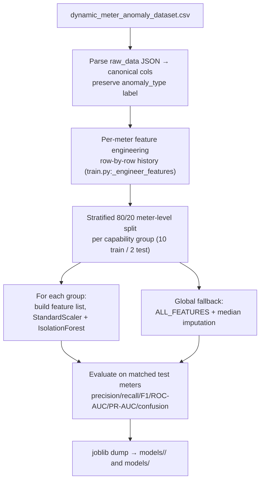
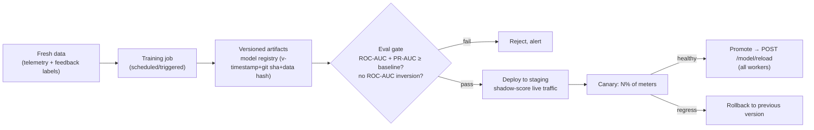

# 04 — Model Training, Locality Adaptation & the ML Lifecycle

> **Scope:** the current synthetic-data + training process in detail; how realistic the data is;
> whether Isolation Forest is the right long-term algorithm; locality/customer-class modeling;
> concept/data drift; the retraining/MLOps lifecycle; and the human-in-the-loop feedback path.
> Markers: ✅ today · ⚠️ partial/fragile · 🔲 recommended. Backend paths under `ecosentinel-backend/`.

---

## 1. Current synthetic data generation ✅ (`dataset/generate_dataset.py`)

The pipeline is trained **entirely on synthetic data**, deliberately built to be physically plausible.

### 1.1 Roster and volume
- **`METER_ROSTER`** (lines 63-99): 72 meters = 12 per group × 6 groups, deterministic. The first 2–3
  serials of each group are the **real test serials** from `test_data_payloads.json` (e.g.
  `SE2303001`), so those meters appear in training with the right profile.
- **Volume** (`DATASET_CONFIG`, `config/settings.py:55-60`): 30 days × 48 readings/day (30-min
  intervals) × 72 meters ≈ **103,680 rows**. Seeded RNG (`random_seed=42`) for reproducibility.

### 1.2 Consumption physics
- **Diurnal load curves** in kW per hour, separate weekday vs weekend
  (`HOURLY_LOAD_WEEKDAY/WEEKEND`, lines 142-154): night trough, morning peak (~1.2 kW at 8am), midday
  plateau, evening peak (~1.5 kW at 7pm). Per-meter `meter_load_scale ∈ [0.6, 1.8]` (line 516)
  simulates household size; ±15% multiplicative noise (`LOAD_NOISE_CV`, line 158).
- **Electrical derivation** (`derive_electrical`, lines 285-330) from a single load value using real
  single-phase AC relations: `I = P·1000/(V·PF)`, `S = P/PF`, `E = P·Δt·1000`, `Eapp = S·Δt·1000`,
  with **voltage droop** `V = V_base − I·0.05` (each amp drops 0.05 V). Measurement noise on V/I.
- **PF is load-dependent** (`sample_pf`, lines 333-343): lighter loads → higher PF. **Voltage baseline
  is an AR(1) random walk** per meter (lines 527-532) with a per-meter network offset — a nice touch
  simulating LV-network position.
- **Frequency** ~N(50, 0.04) for group_D (line 348).

### 1.3 Anomaly injection & correlation
- **`ANOMALY_CATALOGUE`** (lines 202-266): 8 types across subtle/obvious energy spikes, negative
  energy, sustained zero, tamper bypass, voltage sag/swell, PF collapse — with per-type probabilities
  summing to ~5–6%. Severities span subtle (1.2–2×) → obvious (4–8×).
- **Correlated physics** (`_apply_anomaly`, lines 382-502): an energy spike also raises current and
  sags voltage; tamper bypass suppresses energy but keeps current high; voltage sag raises current at
  constant power; PF collapse raises apparent energy and current. This is the generator's best
  feature — anomalies are **multivariate and physically consistent**, exactly what a multivariate
  detector needs.
- **Capability-aware relabeling** ✅ (lines 495-500): if an injected anomaly changes *no* parameter
  the meter actually tracks (e.g. a voltage_sag on an energy-only meter), it is **relabeled
  `"normal"`** to avoid phantom labels. Sustained-zero is injected as a 3–7 reading *block*, not
  isolated (lines 573-592).
- Labels are stored in `raw_data["anomaly_type"]` for exact recovery at training time (line 612).

### 1.4 How realistic — and where it diverges ⚠️

**Realistic:** diurnal shape, weekday/weekend split, per-meter scale, load-dependent PF, voltage
droop/random-walk, correlated multivariate anomalies, plausible anomaly rate.

**Diverges from real HES data:**
| Aspect | Synthetic | Real |
|---|---|---|
| **Phase** | Single-phase only | Real-world fleets include three-phase meters (per-phase V/I, imbalance) — a stated future requirement ([C4](./known-limitations.md)) |
| **Seasonality** | 30 days, no seasonal/weather trend | Strong seasonal (AC/heating), weather-driven |
| **Missing/late data** | Every interval present, in order | Gaps, comms failures, out-of-order backfill |
| **Meter diversity** | 72 meters, one consumption archetype | Residential/commercial/industrial with very different shapes |
| **Anomaly labels** | Ground-truth known | Unknown; must be inferred or operator-labeled |
| **Noise/quirks** | Clean Gaussian noise | Register rollovers, clock drift, unit inconsistencies, firmware bugs |
| **Tariff/behavior change** | None | Tariff switches, EV/solar adoption, appliance changes |
| **Value scale** | Wh per 30-min interval | Often cumulative registers needing differencing |

**Critical caveat:** the metrics from `train.py` are computed on synthetic test meters whose anomalies
were injected by the same code that trains the model — an **optimistic, self-consistent evaluation**.
They still say little about real-world accuracy. (The summary reports ROC-AUC **and PR-AUC / Average
Precision** so the imbalance-aware metric is visible alongside the optimistic one — but on
self-consistent synthetic data even PR-AUC is an upper bound on real-world performance.) (They were previously *also* undermined by the
train/serve skew on `hourly_primary_ratio` — the training pipeline computes it over full history while
serving fell back to a constant `1.0`. That skew is now **fixed** ([C1](./known-limitations.md)):
serving reads the same-hour baseline from a per-meter DB lookback, so the feature that evaluation
rewards is the same feature production now uses.)

---

## 2. Current training process ✅ (`training/train.py`)

- **Feature engineering reuses the runtime engineer** (`compute_features`) row-by-row so training and
  serving match. This used to be defeated for `hourly_primary_ratio` by a history-window mismatch, now
  resolved: serving injects a `baseline_provider` that reads the same-hour average from a large DB
  lookback, matching training's full-history computation ([C1](./known-limitations.md)).
- **Meter-level stratified split** (lines 332-375): keeps all of a meter's readings on one side to
  prevent temporal leakage, and takes ~20% of *each group's* meters for test — guaranteeing every
  group has evaluation data.
- **Exact labels** from `anomaly_type` (`_reconstruct_labels`, lines 171-181), re-attached by key
  merge (not positional — a bug the code comments note was fixed, lines 316-323).
- **Per-group models** trained only on that group's features — no imputation (lines 390-454).
- **Global fallback** trained on `ALL_FEATURES` (12) with median imputation (lines 461-489).
- **IF params** (lines 70-76): `n_estimators=200`, `max_samples=1024`, `contamination=0.07`,
  `random_state=42`.
- **Metrics reported** per model: precision, recall, F1, ROC-AUC, **PR-AUC (Average Precision)**, and
  the confusion matrix (`_train_and_evaluate`), all guarded so single-class test groups degrade to a
  "metrics not computable" note. **PR-AUC is the more appropriate headline metric** for this task:
  with only ~5–6% positive (anomaly) labels, ROC-AUC is inflated by the large true-negative pool,
  whereas PR-AUC's baseline is the positive prevalence — so it reflects how well the model actually
  ranks the rare anomalies. Both are printed per model and in the final summary table.
- ⚠️ **`group_D` feature-list drops frequency & active_export_energy** ([C3](./known-limitations.md)).

**Moving from synthetic → real HES data** requires:
1. Replace the CSV source with real telemetry from `meter_telemetry` (schema-on-read JSONB already
   supports it).
2. Solve labeling: real data has no `anomaly_type`. Options — treat all history as "presumed normal"
   and train **purely unsupervised** (IF/autoencoder), and/or bootstrap labels from the rule layer +
   operator feedback ([C13](./known-limitations.md)).
3. Handle 3φ, gaps, seasonality, and register differencing (§1.4).
4. Re-evaluate honestly on held-out real anomalies (confirmed cases), not injected ones.

---

## 3. Is Isolation Forest the right long-term algorithm?

**Short answer: keep IF as a fast baseline, but it is *not* the right long-term primary detector.**
Two concerns from the prompt:

### (a) Scalability to millions of meters & high ingestion
IF **inference** is cheap and embarrassingly parallel (per-reading tree traversal), so raw throughput
is fine. The scaling pain is elsewhere: **one model per capability group is manageable (6), but the
moment you need per-locality × per-customer-class × per-phase-type models, the matrix explodes**
(6 groups × N localities × 3 classes → hundreds/thousands of artifacts to train, version, load, and
hot-reload). IF gives no natural way to share structure across these; each is retrained from scratch.

### (b) Handling diverse & growing parameter sets
IF needs a **fixed feature vector per model**, so every new parameter set is a new model
(the group proliferation above). It also can't natively model **temporal/seasonal structure** — the
very thing that caused the diurnal-ramp inversion and forced the `hourly_primary_ratio` workaround
([C1](./known-limitations.md)). As parameters grow (3φ, reactive quadrants), the per-group-model
approach becomes a combinatorial burden.

### Alternatives — honest trade-offs

| Approach | Accuracy on meter data | Interpretability | Train/infer cost | Ops complexity | Handles seasonality | Verdict |
|---|---|---|---|---|---|---|
| **Isolation Forest (current)** | Medium; poor on temporal patterns | Medium (score only) | Very low | Medium (many models) | ❌ (needs hand-engineered normalization) | Keep as fast baseline |
| **Forecasting-residual** (Prophet / SARIMA / quantile GBM / LSTM; flag large residuals) | High for consumption; native seasonality | High (expected vs actual) | Med train / low-med infer | Medium | ✅ | **Recommended primary** for consumption anomalies |
| **Robust statistical baselines** (per-meter/per-hour median + MAD, seasonal-hybrid ESD/STL) | Medium-high; very robust | High | Very low | Low | ✅ (with seasonal decomposition) | **Recommended cheap workhorse**, esp. cold-start |
| **Autoencoder / deep anomaly (VAE, LSTM-AE)** | High multivariate; scales to many params | Low | High train / med infer | High | Partial | Later, when data volume justifies |
| **One-class SVM** | Medium; poor scaling | Low | High train (O(n²)) | Medium | ❌ | Not for scale |
| **GNN / topology-aware theft models** | High for NTL (cross-meter) | Low-med | High | High | n/a | Advanced/moat (see `02-...`) |
| **Ensemble / score fusion** | Highest | Med | Med | High | via components | End-state |

### Recommendation — phased
1. **Now:** keep IF. **[C1](./known-limitations.md) is now fixed** (serving reads the same-hour
   baseline from a per-meter DB lookback), so IF's primary feature works; the next cheap win is a
   **robust per-meter/per-hour median+MAD baseline** as a parallel detector (also solves cold-start
   via segment fallback, §4), and moving the same-hour baseline into a persisted store (§4) to also
   cover cold-start.
2. **Next:** introduce **forecasting-residual detection** (start with quantile-regression GBM or
   Prophet per segment) as the primary consumption-anomaly detector; IF stays for multivariate
   cross-parameter oddities (E/I/PF combinations it's genuinely good at, e.g. tamper bypass).
3. **Later:** as labeled feedback accumulates ([C13](./known-limitations.md)) and data volume grows,
   evaluate **autoencoders** for high-dimensional 3φ and a **learned ensemble/score-fusion** that
   replaces the current hard-OR verdict ([C5](./known-limitations.md)) with calibrated severity.

The current hard-OR fusion + fixed contamination should eventually become a **calibrated, weighted
score** so downstream can prioritize by severity rather than boolean.

---

## 4. Locality & customer-class adaptation 🔲

Consumption has **no universal baseline**: a rural residential feeder, an urban commercial strip, and
an industrial estate have radically different diurnal shapes, magnitudes, and "normal" variance. The
current system has **one archetype** (a residential-ish diurnal curve) and **no notion of locality or
customer class** anywhere in config, schema, or models.

### Modeling strategies (combine, don't pick one)

| Strategy | Pros | Cons | Cold-start |
|---|---|---|---|
| **Per-meter baseline** (each meter its own history) | Most accurate; captures idiosyncrasy | Needs weeks of history; storage/compute per meter; cold-start blind | ❌ worst |
| **Per-segment model** (locality × customer-class × phase-type) | Generalizes; new meters inherit segment norm | Needs good segmentation metadata | ✅ good |
| **Hierarchical / global-plus-local** (global prior → segment → meter, blended by data volume) | Best of both; graceful cold-start; shares structure | More engineering | ✅ best |

**Recommended: hierarchical.** A new meter starts on its **segment** baseline (locality + customer
class + phase type), then **blends toward its own per-meter baseline** as history accumulates (e.g.
Bayesian shrinkage / weighted blend by sample count). This directly solves the **cold-start problem**
([C6](./known-limitations.md)): the segment provides an immediate "expected" value so z-score/IF can
function from reading one.

### What has to be built
- **Segment metadata**: add `locality`, `customer_class`, `phase_type`, `tariff` to meter master data
  (none of this exists in the current schema — it must be introduced as meter master data).
- **Segment-aware baselines**: per-(segment, hour-of-day, day-type) expected value + spread, persisted
  (extends the now-wired per-meter `get_historical_avg_same_hour` baseline — see
  [C1](./known-limitations.md) — to segment level; the `baseline_provider` seam is the natural
  injection point).
- **Routing key** = capability group **×** segment, replacing today's group-only routing. (This is the
  model-proliferation risk that argues against pure per-group IF, §3.)

---

## 5. Concept & data drift 🔲

Consumption patterns shift: **seasonality** (summer AC), **tariff changes** (behavior shifts under
time-of-use pricing), **new loads** (EV chargers, rooftop solar → export energy). None of this is
monitored today.

**Detect drift by:**
- **Input drift**: population statistics of features per segment over time (PSI / KL divergence on
  `energy`, `hourly_primary_ratio`, etc.); alarm on shift.
- **Prediction drift**: track the anomaly rate per segment — a jump from ~7% to 30% usually means the
  world moved, not that theft tripled.
- **Performance drift**: once operator feedback exists, track precision/recall over time on confirmed
  cases.
- **Seasonal awareness**: use seasonal decomposition (STL) so summer isn't flagged wholesale.

**Trigger retraining** on: scheduled cadence (e.g. monthly), drift-threshold breach, or a labeled-data
milestone. Weather/tariff/calendar covariates (Tier-3, `02-...`) reduce false drift alarms.

---

## 6. Retraining lifecycle / MLOps 🔲 (build on the hot-reload endpoint)

Today: `training/train.py` writes `models/`, and `POST /model/reload` (`api/main.py:539-563` →
`if_detector.reload_artifacts`) hot-swaps them in-process. That's the *only* MLOps primitive. Build:

- **Versioning & reproducibility**: stamp each artifact bundle with model version + git SHA + dataset
  hash + config snapshot; keep the old bundle for rollback. (Today artifacts are gitignored and
  overwritten in place — no history, no rollback.)
- **Evaluation gates**: block promotion unless metrics beat the incumbent **and** sanity checks pass
  (e.g. ROC-AUC > 0.5 per group — a direct guard against the inversion that motivated
  [C1](./known-limitations.md) — plus a **PR-AUC floor**, since on the imbalanced labels PR-AUC is the
  metric that actually reflects anomaly-ranking quality).
- **Shadow + canary**: score live traffic with the new model without acting, compare to incumbent, then
  ramp. The hot-reload endpoint is the promotion mechanism; add a version arg + registry behind it.
- **Safe rollback**: `POST /model/reload?version=previous`. Because reload is already atomic per
  process, rollback is cheap once versioning exists.

Concrete new scripts needed are listed in `07-production-and-ops.md` (retraining job, eval-gate,
registry, backfill/replay).

---

## 7. Human-in-the-loop feedback 🔲

There is **no feedback path today** ([C13](./known-limitations.md)) — `anomaly_log` has no operator
disposition column and no endpoint to set one.

**Build:**
1. **Capture**: add `disposition` (`confirmed | false_positive | benign_explained | pending`),
   `dispositioned_by`, `dispositioned_at`, and free-text notes to `anomaly_log`; expose
   `POST /anomalies/{id}/feedback`. The frontend `/explain` page is the natural place to collect it.
2. **Curate**: dispositions become a **labeled dataset** — the first real ground truth the system has.
3. **Learn**: (a) tune thresholds/contamination per segment to hit target precision; (b) move toward
   **semi-supervised** detection (e.g. PU-learning, or supervised classifiers on top of detector
   scores) as labels accumulate; (c) feed confirmed-benign cases back into baselines to counter the
   baseline-freeze problem ([C7](./known-limitations.md)).
4. **Close the loop with drift/retraining** (§5–6): feedback-labeled precision is the promotion gate.

This is also what turns the LLM `possible_false_positive_scenarios` output from a nicety into a
**data-generating asset**: operators confirming/denying those scenarios is high-signal labeling.

---

## 8. Bottom line

The synthetic data is **thoughtfully physical** and the training scaffolding (per-group models,
stratified split, exact labels, reuse of the runtime feature engineer) is **above-average for a
prototype**; its evaluation remains self-consistent and optimistic. The train/serve skew that used to
silently undermine it ([C1](./known-limitations.md)) is now **fixed** — serving reads the same-hour
baseline from a per-meter DB lookback. For production, the remaining work: **add robust per-segment
baselines and forecasting-residual detection, make models hierarchical (global→segment→meter) to solve
cold-start and locality, move the same-hour baseline into a persisted store, and stand up a real MLOps
loop (versioning → eval gate → canary → rollback) plus an operator-feedback channel** that finally
gives the system ground truth. Keep Isolation Forest as a fast multivariate baseline, not the sole
detector.
</content>
