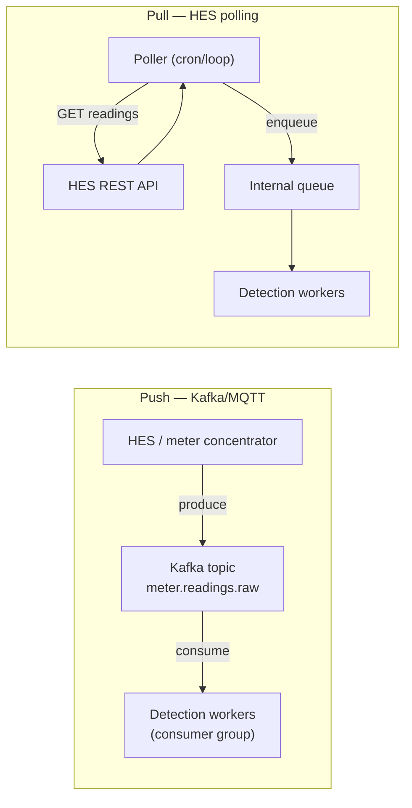
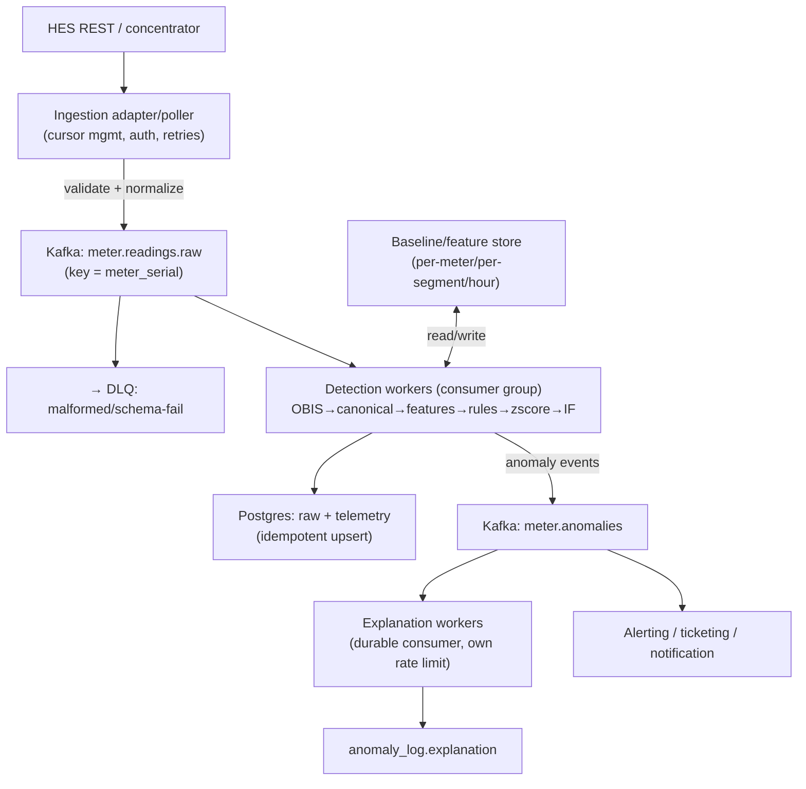
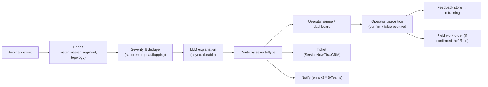

# 05 — Real-Time / Streaming Data Ingestion

> **Scope:** how EcoSentinel should receive and process a continuous meter stream (Kafka push vs HES
> pull), how to re-architect from today's request/response `POST /detect`, the post-detection
> workflow, how realistically it can run on real-time data as-is, and the concrete problems of
> real-time data with solutions. Markers: ✅ today · ⚠️ partial · 🔲 recommended.

---

## 1. How it works today (and why it's not streaming) ⚠️

Today ingestion is **synchronous pull-by-caller**: something must call `POST /detect` with a batch of
records (`api/main.py:339-463`). For each record the API fetches 5 history rows, runs the pipeline,
persists, and (for anomalies) schedules an in-process LLM `BackgroundTask`. There is **no consumer, no
queue, no continuous loop** — the service is a stateless function invoked on demand.

**Can it run on real-time data as-is?** ⚠️ *Partially, and poorly.* You could point a script that
polls the HES and forwards batches to `/detect`, and it would "work" for low volume. But:
- It processes records in a **serial for-loop** with multiple synchronous DB round-trips each
  ([C8](./known-limitations.md)) — throughput is low.
- The **key ML feature** used to be inert at inference ([C1](./known-limitations.md), now **fixed**);
  verdict quality still depends on each meter having accumulated same-hour history (cold-start,
  [C6](./known-limitations.md)).
- **LLM tasks are non-durable** ([C9](./known-limitations.md)) — restarts drop pending work.
- **No idempotency at the app layer** beyond DB `ON CONFLICT` — replays re-run detection and re-spend
  LLM tokens.
- **No handling of gaps, out-of-order, or malformed real payloads** (3φ codes would be dropped,
  [C4](./known-limitations.md)).

So: usable for a demo against real endpoints, **not** a real-time production ingestion path.

---

## 2. Push (Kafka) vs Pull (HES polling) — trade-offs

| Dimension | Push (Kafka) | Pull (HES polling) |
|---|---|---|
| **Latency** | Low (near-real-time) | Bounded by poll interval |
| **Backpressure** | Natural (consumer lag, partitions) | Manual (poller must throttle) |
| **Ordering** | Per-partition ordering (key by meter) | Whatever HES returns |
| **Replay / audit** | Built-in (retention, offsets) | Must re-request; may not be available |
| **Scaling** | Add partitions + consumers | Shard meters across pollers |
| **Coupling to HES** | Decoupled (HES owns producer) | Tight (poller must track cursors) |
| **Delivery** | At-least-once (usually) | At-least-once (dedupe on re-poll) |
| **Fit** | Best when HES/concentrator can produce a stream | Fits when the HES only exposes a request/response REST API |

**Reality check:** the repo has **no ingestion integration at all today** — the only entry point is
the synchronous `POST /detect` (`api/main.py:339`), which a caller must invoke. Since many HES
platforms expose only a polling REST API rather than a stream, the pragmatic path is:

**Recommended: pull at the edge, push internally.** A **poller/adapter service** reads the HES REST
API (or receives HES pushes where available), normalizes each record, and **produces to an internal
Kafka topic**. All downstream detection consumes Kafka. This decouples the messy HES boundary from the
detection core and gives replay, backpressure, and horizontal scaling regardless of what the HES
supports. If/when the HES can push (MQTT/Kafka), the poller is swapped for a bridge with no downstream
change.

---

## 3. Target streaming architecture 🔲

Key architectural moves vs today:
1. **Decouple ingestion, detection, and explanation** into separate consumer groups so each scales and
   fails independently. (Today all three share one API process.)
2. **Detection workers are stateless** consumers; per-meter state (baselines, rolling history) lives in
   Postgres and/or a **feature/baseline store** (Redis or a materialized table). The
   [C1](./known-limitations.md) fix already reads per-meter same-hour baselines from Postgres (via the
   `baseline_provider` seam) rather than a 5-row window; promoting that to a dedicated store is the
   scale-out continuation of the same design.
2. **Explanation becomes its own durable Kafka consumer** (fixes [C9](./known-limitations.md)) with its
   own rate limit and retry — a restart just resumes from the offset; nothing is orphaned.
4. **Anomalies are events** on `meter.anomalies`, fanned out to explanation, alerting, and ticketing.
5. **DLQ (dead-letter queue)** for records that fail parse/validation, for later inspection/replay.

The existing `pipeline/` package is reusable **as-is** inside a worker — `run(api_record, history)` is
already a pure function. The re-architecture is mostly *around* the pipeline (transport, state,
durability), not inside it.

---

## 4. Post-detection workflow (streamline the flow) 🔲

Input from HES → detect → **then what?** Today the answer is "write to DB and maybe generate an
explanation." A production flow:

- **Deduplication/suppression**: a meter flagging every 30 min for a sustained condition
  ([C7](./known-limitations.md)) must collapse into **one open case**, not thousands of alerts.
- **SLAs**: severity-based (e.g. voltage-safety events acted on in minutes; subtle theft triaged in
  days). Track time-to-disposition.
- **Ticketing/remediation**: confirmed theft → revenue-protection work order; power-quality → grid ops.
- **Feedback capture**: closes the loop to `04-...` §7 — the disposition is the label.

This workflow is the *product*; detection is just the trigger. Almost none of it exists today (only
detect + explanation), so it's the biggest greenfield build after correctness fixes.

---

## 5. Problems of real-time data — and concrete solutions

| Problem | Why it hurts EcoSentinel specifically | Solution |
|---|---|---|
| **Late / out-of-order records** | Rolling/same-hour features assume chronological history; `interval_timestamp` can arrive after later readings (meter reconnect) | **Watermarking + event-time windowing**; key by meter and order by `interval_timestamp`; the schema already uses `interval_timestamp` not `received_at` (`db/schema.sql:58-60`) — recompute affected windows on late arrival |
| **Duplicates / replays** | Re-running detection re-spends LLM tokens; double-counts | **Idempotency**: DB `ON CONFLICT DO NOTHING` already dedupes raw/telemetry (`db/client.py:118, 148`); add an **idempotency key** (meter+interval) at the app layer so detection/explanation are skipped for already-processed intervals |
| **Missing readings / gaps** | Cold windows → z-score/IF can't fire ([C6](./known-limitations.md)); baselines stale | **Gap detection + segment fallback baseline**; forward-fill only for short gaps; flag comms-loss as its own event (`sustained_zero` already models this) |
| **Malformed / unknown OBIS** | 3φ & reactive codes are dropped silently ([C4](./known-limitations.md)); a bad payload could empty the canonical dict | **Schema/contract validation at the adapter** + **DLQ**; alert on rising unknown-OBIS rate; register real codes (`03-...`) |
| **Schema changes at HES boundary** | New firmware adds/renames codes; poller breaks | **Contract testing** against sample payloads; version the OBIS registry; **schema registry** for the Kafka topic; unknown-code metric as an early warning |
| **Backpressure / throughput** | Serial loop + 10-conn pool + per-record extra reads ([C8](./known-limitations.md), [C15](./known-limitations.md)) can't keep up | **Partitioned Kafka + horizontal consumers**; batch DB writes; remove the redundant logging reads; raise pool size / use pgbouncer |
| **Cold windows / insufficient history** | New meters invisible until seeded ([C6](./known-limitations.md)) | **Hierarchical baselines** (segment → meter, `04-...` §4) so detection works from reading one |
| **Exactly-once vs at-least-once** | LLM spend and alerts should not duplicate | Accept **at-least-once transport** + **idempotent processing** (effectively-once); make detection and explanation side-effects keyed by meter+interval |
| **Clock skew / drift** | Meter clock vs server time; bad `interval_timestamp` | Validate timestamp sanity at the adapter; quarantine implausible timestamps to DLQ |
| **Poison messages** | One bad record stalls a partition | **DLQ after N retries**; never block the partition on a single record |

**Delivery-semantics recommendation:** at-least-once Kafka delivery + **idempotent, keyed processing**
(meter_serial + interval_timestamp) throughout. True exactly-once (Kafka transactions) is usually
unnecessary and costly here; idempotency at the DB/side-effect layer gives the same practical
guarantee for detection and LLM spend.

---

## 6. How much of today's code survives the transition?

**Survives ✅:** the whole `pipeline/` package (pure function `run()`, which already accepts an
injectable `baseline_provider`), `config/settings.py`, `db/schema.sql` (with additions), the
decision-engine modules (reused inside an explanation worker), canonical mapping, and the feature
engineer (the [C1](./known-limitations.md) fix already reads same-hour baselines through the provider
seam; pointing it at a baseline store is a drop-in change).

**Must be added 🔲:** ingestion adapter/poller, Kafka topics + schema registry, detection worker
harness (consume → `run()` → produce), durable explanation worker, baseline/feature store, DLQ +
replay tooling, idempotency keys, alerting/ticketing integration, and the operator-disposition path.

**Must change ⚠️:** `api/main.py`'s serial batch loop and in-process `BackgroundTask` model — the
FastAPI service should shrink to *synchronous on-demand scoring + query APIs*, while the continuous
path moves to workers. Remove the redundant per-record baseline-logging reads
([C15](./known-limitations.md)).

---

## 7. Bottom line

EcoSentinel's **detection core is already a clean, reusable pure function**, which makes the streaming
transition mostly an *infrastructure-around-the-core* exercise rather than a rewrite. The pragmatic
architecture is **pull from the HES at the edge, push to Kafka internally**, with **separate stateless
detection workers and durable explanation workers**, per-meter/segment **baselines in a state store**
(which also fixes the biggest correctness bug), and a real **post-detection workflow** (dedupe →
severity → alert/ticket → operator disposition → feedback). As-is, the system can be *pointed at*
real-time data but will be slow, lossy on restarts, blind on cold/3φ/gap data, and low-accuracy — so
streaming should be built **after** the correctness fixes in `known-limitations.md`.
</content>
