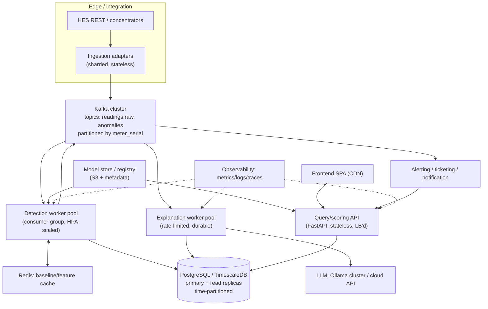

# 06 — Scale & Architecture

> **Scope:** how EcoSentinel behaves at scale (thousands → millions of meters, high ingestion),
> how to scale each component (stateless vs stateful, DB, caching, LLM throughput), and where every
> service runs in a scaled deployment plus how they communicate. Markers: ✅ today · ⚠️ partial ·
> 🔲 recommended. Read alongside `05-realtime-streaming.md` (ingestion) and `07-production-and-ops.md`
> (deployment/ops).

---

## 1. Where it stands on scale today ⚠️

Back-of-envelope for the target fleet:

| Fleet | Interval | Readings/sec (avg) | Peak burst (all meters at :00/:30) |
|---|---|---|---|
| 10k meters | 30 min | ~5.6/s | 10k in a short window |
| 100k meters | 30 min | ~56/s | 100k burst |
| 1M meters | 30 min | ~556/s | **1M in a burst** |
| 10M meters | 15 min | ~11,000/s | 10M burst |

The **burst pattern matters most**: meters report on aligned boundaries, so load is spiky, not smooth.

**Today's ceiling:** a single FastAPI process, a serial per-record loop with multiple synchronous DB
round-trips each and *extra* redundant reads ([C8](./known-limitations.md), [C15](./known-limitations.md)),
a `min=1/max=10` connection pool (`db/client.py:41-49`), and in-process LLM tasks
([C9](./known-limitations.md)). Realistically this handles **low hundreds of readings/sec at best** and
falls over on a 1M-meter burst. It is a single-node prototype.

---

## 2. Stateless vs stateful decomposition 🔲

The scaling strategy hinges on separating what can scale horizontally from what holds state.

| Component | State? | Scaling approach |
|---|---|---|
| **Ingestion adapter/poller** | Light (HES cursors) | Shard meters across instances; cursors in Redis/DB |
| **Kafka broker** | Yes (the log) | Partition by `meter_serial`; add partitions/brokers |
| **Detection workers** | **Stateless** | Horizontal — one consumer group, scale to N; per-partition ordering keeps a meter on one worker |
| **Feature/baseline store** | **Stateful (hot)** | Redis/materialized table; per-meter/segment baselines; sharded/replicated |
| **PostgreSQL** | **Stateful (durable)** | Partition + read replicas (§4) |
| **Explanation (LLM) workers** | Stateless (compute) | Horizontal, but bounded by LLM capacity (§5) |
| **Query/scoring API (FastAPI)** | Stateless | Horizontal behind a load balancer |
| **Frontend** | Stateless | CDN/static hosting |

**Key enabler:** the `pipeline.run(api_record, history, baseline_provider)` function is already
pure/stateless — the state it needs is `history` plus the same-hour baseline, both sourced from
Postgres today (the latter via the injected `baseline_provider` added in the
[C1](./known-limitations.md) fix). Moving those reads to a **baseline/feature store** makes detection
workers trivially horizontal.

The one **stateful subtlety**: rolling/baseline computation needs a meter's recent history. Keying
Kafka by `meter_serial` pins each meter to one partition/worker, enabling local caching of that meter's
window and preserving order — the standard pattern for stateful stream processing.

---

## 3. Detection worker scaling 🔲

- **Partition by meter**, scale the consumer group to match throughput; a worker handles a stable
  subset of meters and can cache their baselines in-process (write-through to the store).
- **Batch DB writes** (telemetry/anomaly) instead of per-record inserts; use `COPY`/`execute_values`
  for telemetry (the seed script already uses `execute_values`, `utils/seed_normal_history.py:245`).
- **Remove hot-path waste**: the two extra history reads + `summarize_rolling_state` logging passes per
  record ([C15](./known-limitations.md)) roughly halve DB load once removed.
- **Model loading**: group models are lazy-loaded and cached per process (`if_detector._group_cache`),
  which is fine — but with per-locality×class models ([C1](./known-limitations.md)/`04-...`), the model
  matrix could exceed a worker's memory. Mitigate with an **LRU model cache** + a shared **model store**
  (S3/registry) so workers page models in/out rather than holding all.

---

## 4. Database scaling ⚠️→🔲

Postgres is the hardest-to-scale piece. Current schema is single-instance (`db/schema.sql`).

- **Time partitioning**: partition `meter_telemetry` and `raw_meter_readings` by time (monthly/weekly);
  the hot query is "last N readings for meter X before T" (`db/client.py:302-322`) — a partitioned +
  `(meter_serial, interval_timestamp DESC)` index (already exists, `db/schema.sql:97-98`) keeps it fast.
- **Time-series engine**: **TimescaleDB** (hypertables, continuous aggregates, retention policies) is a
  natural fit and would materialize the **per-meter/per-hour baselines** — the same-hour averages the
  [C1](./known-limitations.md) fix currently computes on demand — as a continuous aggregate, replacing
  the per-request `AVG` with a precomputed lookup.
- **Read replicas**: history/baseline reads (the hot path) go to replicas; writes to primary. Detection
  is read-heavy on history, write-heavy on telemetry — separate them.
- **Retention & tiering**: raw audit data ages to cold storage (object store); keep recent telemetry
  hot. `raw_meter_readings` grows fastest and is rarely read — archive aggressively.
- **Sharding** (10M+ meters): shard by meter_serial/utility if a single Timescale cluster saturates.
- **Caching**: a **Redis baseline cache** (per-meter/segment/hour expected value + spread) absorbs the
  hot read so Postgres isn't hit per reading; this is both a scale and a correctness lever.

---

## 5. LLM explanation throughput — the real bottleneck ⚠️

Explanation is the most expensive per-anomaly step and the least scalable:

- A local Ollama model takes **3–15s** per explanation (`api/main.py:587`); cloud APIs have rate limits
  and per-token cost.
- At 1M meters and even a **1% anomaly rate**, that's ~10k anomalies per 30-min cycle. At 5s each, a
  single LLM worker does ~360/half-hour — you'd need **~28 workers just to keep up**, before cost.
- Combined with the ~7% IF false-positive floor ([C5](./known-limitations.md)), naive "explain every
  anomaly" is financially and operationally infeasible at scale.

**Mitigations:**
1. **Don't explain everything.** Explain only **high-severity or newly-opened cases** after dedupe
   ([C5](./known-limitations.md), `05-...` §4). Suppress repeats of an open case.
2. **Fix false positives first** — the [C1](./known-limitations.md) feature skew is now fixed;
   [C5](./known-limitations.md) (contamination floor + hard-OR verdict) still needs addressing so the
   explanation volume is real.
3. **Async, durable, rate-limited worker pool** (`05-...` §3) with a bounded concurrency and a queue —
   explanations can lag detection without blocking it.
4. **Cache/templatize** common explanation classes (a hard rule violation like `voltage_too_low`
   barely needs an LLM — a template suffices; reserve the LLM for genuinely multivariate cases).
5. **Batching / smaller models** for routine cases; escalate to a larger model only for ambiguous ones.

---

## 6. Service topology at scale

**How components communicate:**
- HES → adapters: **REST pull** (today) or push bridge.
- adapters → detection: **Kafka** (async, partitioned, replayable).
- detection ↔ state: **Redis** (baselines) + **Postgres** (durable telemetry/anomalies).
- detection → explanation/alerting: **Kafka events** (`meter.anomalies`).
- explanation → LLM: **HTTP** (LiteLLM, provider-agnostic — already built).
- API/frontend: **REST** for on-demand scoring, queries, ops, feedback.
- workers ← models: pull versioned artifacts from the **model store/registry** (replaces
  gitignored local `models/`).

---

## 7. What scales well vs what needs the most work

| Aspect | Assessment |
|---|---|
| Detection compute | ✅ Easy — pure function, horizontal once state is externalized |
| Ingestion | 🔲 Needs the whole adapter→Kafka layer (`05-...`) |
| DB | ⚠️→🔲 Needs partitioning/Timescale + replicas + caching |
| Baselines/features | ⚠️ [C1](./known-limitations.md) same-hour baseline now read from Postgres via the provider seam; should still move to a dedicated store at scale |
| LLM explanations | ⚠️ Hardest to scale economically — needs selective explanation + rate-limited durable pool |
| Model management | 🔲 Model matrix could explode ([C1](./known-limitations.md)/`04-...`); needs registry + LRU cache |
| Query API/frontend | ✅ Straightforward horizontal + CDN |

---

## 8. Bottom line

Because the detection core is already stateless-friendly, EcoSentinel can scale to millions of meters
**architecturally** — the work is almost entirely in the surrounding infrastructure: **Kafka ingestion,
externalized per-meter/segment baselines (Redis + TimescaleDB continuous aggregates), horizontal
stateless detection workers, and a rate-limited durable explanation pool.** The two hardest scale
problems are **the database** (solved by time-partitioning/Timescale + replicas + caching) and **LLM
explanation economics** (solved by fixing false positives, explaining selectively, and templating
routine cases). None of this should be built before the remaining correctness fixes in
[`known-limitations.md`](./known-limitations.md) — the primary-feature skew ([C1](./known-limitations.md))
is now fixed, but scaling a detector with an unaddressed false-positive floor ([C5](./known-limitations.md))
or undetectable parameters ([C3](./known-limitations.md)) just scales the wrong answers.
</content>
