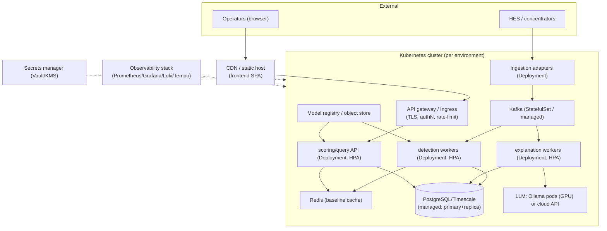
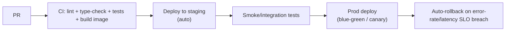

# 07 — Production Deployment & Operations

> **Scope:** how to run EcoSentinel in production across localities and customer types — deployment
> topology, CI/CD and safe rollout for code *and* models, the production scripts/tooling that don't
> exist yet, and the operational cross-cutting concerns (observability, security/privacy,
> multi-tenancy, DR, cost). Markers: ✅ today · ⚠️ partial · 🔲 recommended. Backend paths under
> `ecosentinel-backend/`.

---

## 1. What exists for "production" today ⚠️

- **Config via env vars** ✅ — DB, model dir, LLM provider/model/key all read from environment
  (`config/settings.py`), so 12-factor-style configuration is already possible. `.env` supported via
  `python-dotenv` (`config/settings.py:2, 6`).
- **Graceful degradation** ✅ — runs without DB; fails fast on missing models at startup but keeps
  serving (`api/main.py:102-131`).
- **Hot model reload** ✅ — `POST /model/reload` (`api/main.py:539-563`).
- **Health endpoint** ✅ — `/health` reports model + DB status (`api/main.py:466-504`).
- **Structured-ish logging** ⚠️ — rich `logging` with timings throughout, but plain-text format
  (`api/main.py:61-64`), not JSON; no correlation IDs, metrics, or tracing.

**Missing for production 🔲:** containers/orchestration manifests, CI/CD, auth, secrets management,
migrations tooling, streaming consumer, model registry, monitoring/alerting, backups/DR, multi-tenancy.
There is **no Dockerfile, no k8s manifest, no CI config** in the repo.

---

## 2. Recommended deployment topology 🔲

**Where each service runs:**
| Service | Runtime | Notes |
|---|---|---|
| Frontend SPA | CDN / static bucket | Built via `npm run build`; env `VITE_API_BASE_URL` |
| Scoring/query API | K8s Deployment + HPA | Stateless FastAPI (shrunk from today's all-in-one) |
| Ingestion adapters | K8s Deployment | Sharded pollers/bridges (`05-...`) |
| Kafka | Managed (MSK/Confluent) or StatefulSet | Partitioned by meter |
| Detection workers | K8s Deployment + HPA | Stateless consumers |
| Explanation workers | K8s Deployment + HPA | Rate-limited; GPU nodes if self-hosting LLM |
| PostgreSQL/Timescale | Managed service | Primary + read replicas, PITR backups |
| Redis | Managed / StatefulSet | Baseline/feature cache |
| LLM | Ollama on GPU pods **or** cloud API | Provider-agnostic already (`llm_client.py`) |
| Model registry | Object store (S3/GCS) + metadata DB | Replaces gitignored `models/` |

**Environments:** dev → staging → prod, ideally namespace- or cluster-isolated, each with its own DB,
Kafka, and secrets. **Locality/utility deployment**: either one multi-tenant cluster (tenant isolation
in data + models, §6) or per-DISCOM deployments where regulation demands data residency.

---

## 3. CI/CD and safe rollout 🔲

### Application code

- **CI gates**: backend has **no test suite today** (`CLAUDE.md` says testing is manual) — add unit
  tests (pipeline stages, routing, feature math) and contract tests on sample OBIS payloads. Frontend
  already has `npm run lint` (zero-warnings) and `tsc` build (`package.json:10`).
- **Backward/forward compatibility**: the API response is a versioned contract consumed by the typed
  frontend (`types/index.ts`); additive changes only, or version the endpoint.
- **Blue-green or canary** for the stateless API/workers; drain Kafka consumers gracefully on rollout.

### Database migrations
- Today schema is applied via `init_schema()` running `schema.sql` at startup with `IF NOT EXISTS`
  (`db/client.py:83-95`) — fine for greenfield, **unsafe for evolving prod** (no versioning, no down
  migrations, no column changes). 🔲 Adopt a **migration runner** (Alembic/Flyway) with forward-only,
  backward-compatible migrations (expand-contract) so rolling deploys never see an incompatible schema.

### Model rollout (build on hot-reload)
Covered in `04-...` §6: **versioned registry → eval gate (incl. ROC-AUC>0.5 sanity, guarding
[C1](./known-limitations.md)) → shadow → canary → promote via `/model/reload?version=X` → rollback**.
Application and model rollouts are **independent pipelines** — a model can be promoted/rolled back
without a code deploy, which the hot-reload endpoint already enables.

---

## 4. Production scripts/tooling that don't exist yet 🔲

| Tool | Purpose | Builds on |
|---|---|---|
| **Ingestion consumer/adapter** | Continuous HES pull / Kafka bridge → normalized events | net-new (no ingestion integration exists today) |
| **Migration runner** | Versioned, reversible schema changes | replaces `init_schema()` |
| **Backfill / replay tool** | Re-score history after model/OBIS changes; reprocess DLQ | `pipeline.run()` is reusable |
| **Model registry + promote/rollback CLI** | Version, gate, promote, roll back artifacts | `/model/reload`, `train.py` |
| **Retraining + eval-gate job** | Scheduled/triggered training with promotion gates | `train.py`, drift monitors |
| **Drift/quality monitors** | Input/prediction/performance drift per segment | `04-...` §5 |
| **Metrics/health exporters** | Prometheus metrics (throughput, anomaly rate, latency, LLM cost) | extends `/health` |
| **Seed/bootstrap for new deployments** | Warm baselines for a new locality/fleet | `utils/seed_normal_history.py` (dev-only today) |
| **Explanation reaper** | Re-drive/expire orphaned `pending` explanations | fixes [C9](./known-limitations.md) |
| **DLQ inspector/replayer** | Triage malformed/unknown-OBIS records | `05-...` §5 |
| **Feedback/labeling service** | Capture operator dispositions → training data | fixes [C13](./known-limitations.md) |

The existing `utils/reset_db.py` and `seed_normal_history.py` are **dev/test utilities**, not
production tooling (they connect directly with `psycopg2` and are CLI-driven).

---

## 5. Observability, security, DR, cost

### Observability 🔲
- **Logging**: switch to **structured JSON logs** with a per-request/per-reading **correlation id**
  (meter_serial + interval); the current logs are information-rich but unstructured (`api/main.py:61`).
- **Metrics**: readings/sec, detection latency (per stage — timings already computed!), anomaly rate
  per segment (drift signal), IF score distribution, LLM latency/cost/failure rate, consumer lag, DLQ
  depth.
- **Tracing**: distributed traces across adapter → worker → DB → LLM (OpenTelemetry).
- **Dashboards & alerting**: anomaly-rate spikes, consumer lag, model-artifact-missing, DB replica lag,
  LLM error budget, `pending`-explanation backlog.

### Security & data privacy 🔴 (biggest prod gap)
- **AuthN/Z** 🔲 — **no auth on any endpoint today** ([C10](./known-limitations.md)). Add gateway-level
  authentication (OIDC/JWT/mTLS for service-to-service) and RBAC (operator vs admin vs
  model-reload/ops). `/model/reload` and `/detect` must be protected.
- **Secrets** ⚠️→🔲 — env vars work but should come from a **secrets manager** (Vault/cloud KMS); never
  bake LLM keys/DB passwords into images. (Note: `DB_PASSWORD` has no default — good — but the LLM key
  flows through env, `config/settings.py:380`.)
- **Encryption** 🔲 — TLS in transit (gateway, DB, Kafka, LLM); encryption at rest (DB, object store).
- **PII / regulatory retention** 🔲 — meter data is **personal/consumption data** (privacy-regulated in
  many jurisdictions). Define retention windows, purge/anonymization policy, and access audit. **LLM
  data handling**: sending meter data to a *cloud* LLM may violate residency rules — the local-Ollama
  path (already supported) is the compliant default; cloud providers need a data-processing agreement.
- **Input hardening** — the parser tolerates junk (good), but the adapter should validate/contract-test
  HES payloads and rate-limit callers.

### Multi-tenancy (serving multiple utilities/DISCOMs) 🔲
- **None today** — no tenant concept in schema or code. Options: **DB-per-tenant** (strongest
  isolation, residency-friendly, heavier ops) vs **shared DB + `tenant_id` row-level security**
  (cheaper, needs rigorous isolation). **Models are per-tenant** (a DISCOM's consumption patterns must
  not leak across tenants) — the model registry keys on tenant × group × segment. Kafka topics/consumer
  groups namespaced per tenant.

### Disaster recovery / backup 🔲
- **DB**: automated backups + **PITR**; tested restore runbooks; replica in a second AZ/region.
- **Kafka**: retention gives natural replay; mirror to DR cluster if RPO demands.
- **Model registry/object store**: versioned + cross-region replicated (models are reproducible from
  data + code + config, but keeping artifacts avoids retrain time in a DR event).
- **RPO/RTO targets** per data class: raw audit (low RPO tolerance is fine — reproducible), anomaly
  cases and feedback labels (high value — tighter RPO).

### Cost 🔲
| Cost driver | Mitigation |
|---|---|
| **LLM inference** (dominant at scale, `06-...` §5) | Fix false positives; explain selectively; template routine cases; local models for bulk, cloud for escalation; batch |
| **Database** (telemetry volume) | Time-partitioning, retention/tiering to cold storage, compression (Timescale) |
| **Compute (workers)** | HPA scale-to-load; spiky burst → autoscale, don't provision for peak 24/7 |
| **GPU (self-hosted LLM)** | Right-size; share across tenants; queue rather than over-provision |
| **Kafka/managed services** | Partition sizing to actual throughput; tiered storage |

---

## 6. Bottom line

EcoSentinel is **configuration-ready** (env-driven, degrades gracefully, hot-reloadable) but
**operationally bare**: no containers, CI/CD, auth, migrations, monitoring, backups, or tenancy exist
yet, and **security is the single most urgent production gap** ([C10](./known-limitations.md)) — the
service currently trusts anyone who can reach it. A credible production path is: **containerize →
put an authenticating gateway in front → adopt a migration runner and model registry → split the API
from streaming workers → add observability, backups, and per-tenant isolation**, with **LLM cost and
data-residency** as the two decisions that most shape the deployment (favoring the already-supported
local-model path). Deploy across localities via **hierarchical, per-segment/per-tenant models**
(`04-...`) rather than one global model.
</content>
