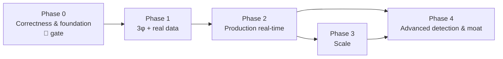

# 08 — Roadmap & Forward-Looking Analysis

> **Scope:** synthesize everything above into a prioritized roadmap — fix correctness/tech-debt first,
> then reach production real-time operation, then scale, then advanced features — plus a candid view of
> where the project can go and the key risks/decisions. Markers: ✅ done · ⚠️ partial · 🔲 to build.
> Cross-references point to the detailed files and to [`known-limitations.md`](./known-limitations.md).

---

## Guiding principle

**Do not scale or productize a detector whose primary feature is inert.** The headline instance of
this — `hourly_primary_ratio` (0.1 / [C1](./known-limitations.md)) — is now **fixed**; the remaining
correctness fixes (Phase 0) gate everything else — accuracy claims, LLM-cost economics, and scale
efficiency all depend on them. Sequence matters more than breadth.

---

## Phase 0 — Correctness & foundation (weeks) 🔴 *do first*

| # | Item | Why | Ref |
|---|---|---|---|
| 0.1 | ✅ **DONE — Fixed `hourly_primary_ratio`**: same-hour baselines now come from a per-meter DB lookback (`SAME_HOUR_LOOKBACK_DAYS`) via an injected `baseline_provider`, not the 5-row window. Follow-up: move to a *persisted* per-meter/per-hour store to also cover cold-start ([C6](./known-limitations.md)) | The ML layer's headline feature was a constant `1.0` at inference — the single biggest bug | [C1](./known-limitations.md) |
| 0.2 | ✅ **DONE — Fixed `same_hour_deviation`** (same root cause; trigger now fires once the baseline is populated) | Documented z-score trigger couldn't fire | [C2](./known-limitations.md) |
| 0.3 | **Wire `frequency` (and `active_export_energy`) into feature engineer + training feature-list** | Frequency anomalies are undetectable by any layer | [C3](./known-limitations.md), [C3.1](./known-limitations.md) |
| 0.4 | **Refactor per-parameter branches** in `feature_engineer` / `train._group_feature_list` to be **data-driven** (loop over group raw features + `DERIVED_FEATURE_MAP`) | Makes "config-only" real; prevents future dropped-feature bugs; unblocks 3φ | `03-...` §2 |
| 0.5 | **Rebalance false-positive pressure**: revisit `contamination=0.07`, add a score-fusion/consensus verdict instead of hard-OR, mitigate the z-score ramp sensitivity | Structural FP floor makes downstream (LLM, ops) infeasible | [C5](./known-limitations.md) |
| 0.6 | **De-hardcode locality constants** (`NOMINAL_VOLTAGE`, freq bounds, holiday calendar) into config | Blocks multi-locality; wrong deviations | [C11](./known-limitations.md) |
| 0.7 | **Add a test suite + honest eval on held-out/real anomalies** | No automated tests exist; synthetic metrics are optimistic | `07-...` §3 |
| 0.8 | **Reconcile docs/config drift** (README/CLAUDE numbers) | Prevent misleading readers/operators | [C14](./known-limitations.md) |

**Exit criteria:** per-group ROC-AUC > 0.5 with the *serving* feature path; frequency anomalies
detected; a passing CI test suite; FP rate measured and acceptable on realistic data.

---

## Phase 1 — Data reality: three-phase + real HES data (weeks–months) 🔲

| # | Item | Ref |
|---|---|---|
| 1.1 | Register three-phase OBIS codes (per-phase V/I, neutral current, per-phase PF/power) | [C4](./known-limitations.md), `03-...` §3.1 |
| 1.2 | Three-phase features (imbalance, neutral current, per-phase deviations) + **3φ rules first** (highest value/effort ratio) | `03-...` §3.3 |
| 1.3 | New 3φ capability groups + extend synthetic generator for 3φ physics | `03-...` §3.3 |
| 1.4 | Ingest **real** telemetry (replace CSV source); handle gaps, seasonality, register differencing | `04-...` §2 |
| 1.5 | Hierarchical baselines (global → segment → meter) → solves cold-start & locality | [C6](./known-limitations.md), `04-...` §4 |

**Exit criteria:** the pipeline runs on the real mixed 1φ/3φ fleet without dropping data; new meters
are covered from reading one via segment baselines.

---

## Phase 2 — Production real-time operation (months) 🔲

| # | Item | Ref |
|---|---|---|
| 2.1 | Ingestion adapter (HES pull) → **Kafka**; DLQ + schema/contract validation | `05-...` §2–5 |
| 2.2 | **Stateless detection workers** consuming Kafka; baselines in Redis/Timescale | `05-...` §3, `06-...` §2 |
| 2.3 | **Durable, rate-limited explanation workers** (fix orphaned `pending`) | [C9](./known-limitations.md), `05-...` §3 |
| 2.4 | Post-detection workflow: dedupe/severity → alert/ticket → **operator disposition → feedback store** | [C13](./known-limitations.md), `05-...` §4 |
| 2.5 | **AuthN/Z + secrets + TLS + retention/PII policy** | [C10](./known-limitations.md), `07-...` §5 |
| 2.6 | Containers, CI/CD, migration runner, model registry with **eval-gate/canary/rollback** | `07-...` §2–4 |
| 2.7 | Observability: structured logs, metrics, tracing, dashboards, alerts | `07-...` §5 |

**Exit criteria:** continuous ingestion with at-least-once + idempotent processing; secured endpoints;
model promotion/rollback via registry; operators dispositioning real cases.

---

## Phase 3 — Scale (months) 🔲

| # | Item | Ref |
|---|---|---|
| 3.1 | Time-partition/**TimescaleDB** + read replicas + retention tiering | `06-...` §4 |
| 3.2 | Redis baseline cache; batch DB writes; remove hot-path redundant reads | [C15](./known-limitations.md), `06-...` §3 |
| 3.3 | Horizontal autoscaling (HPA) for adapters/detection/explanation | `06-...` §2 |
| 3.4 | LLM economics: selective explanation, templating routine cases, model tiering | `06-...` §5 |
| 3.5 | Model registry + LRU model cache (control model-matrix explosion) | [C1](./known-limitations.md), `06-...` §3 |
| 3.6 | DR: PITR backups, cross-region replicas, tested restore runbooks | `07-...` §5 |

**Exit criteria:** sustains fleet-scale burst load (100k→1M meters) within latency/cost budgets;
survives a zone failure within RPO/RTO.

---

## Phase 4 — Advanced detection & differentiation (ongoing) 🔲

| # | Item | Ref |
|---|---|---|
| 4.1 | **Forecasting-residual detection** (per segment) as primary consumption detector; IF for multivariate | `04-...` §3 |
| 4.2 | **Network-context explanations** (transformer/feeder/neighbour comparison) — the real moat | `02-...` §3 |
| 4.3 | **Cross-meter / feeder energy-balance theft detection** | `02-...` §4 |
| 4.4 | Semi-supervised uplift from accumulated feedback labels | `04-...` §7 |
| 4.5 | Drift monitors → auto-retrain triggers; calibrated severity scoring | `04-...` §5 |
| 4.6 | Multi-tenancy for multiple DISCOMs | `07-...` §6 |
| 4.7 | Weather/tariff/calendar covariates; DER (solar/EV) detection | `02-...` §4 |

---

## Roadmap at a glance

---

## Future analysis — where this can go, and the key decisions/risks

**The opportunity.** EcoSentinel already has the two things hardest to retrofit: a **clean, stateless
detection core** and a **provider-agnostic, on-prem-capable explanation layer**. That combination —
explainable, air-gappable, heterogeneous-fleet anomaly triage — is genuinely aligned with where utility
AMI analytics is heading and with Schneider's grid portfolio. If the correctness foundation is fixed and
network-context is added to the explanations, it can become a differentiated revenue-protection + grid-
edge product rather than a commodity anomaly scorer.

**The central risk.** The project *looks* more finished than it is. The architecture, config design,
and explanation UX create an impression of maturity. The most acute correctness gap — the ML layer's
primary feature being inert at serving time — is now **fixed** ([C1](./known-limitations.md)/[C2](./known-limitations.md)),
but an entire parameter is still undetectable (frequency), and three-phase support (a stated
requirement) is absent while the system is single-phase only. **The biggest remaining risk is
scaling/productizing on top of the un-fixed gaps** — you'd get a fast, well-instrumented system
confidently producing unreliable verdicts, and the LLM would eloquently explain false positives at
cloud-scale cost.

**Key decisions ahead:**
1. **Algorithm direction** — keep IF as a baseline vs invest in forecasting-residual + hierarchical
   baselines. (Recommendation: both; IF alone won't scale across locality×class×phase.) `04-...` §3.
2. **Push vs pull ingestion** — constrained today to pull; design for "pull at edge, push internally."
   `05-...` §2.
3. **LLM locality & selectivity** — local vs cloud (residency + cost) and explain-everything vs
   explain-selectively. This single choice dominates production cost. `06-...` §5, `07-...` §5.
4. **Tenancy model** — shared multi-tenant vs per-DISCOM deployment (residency vs ops cost). `07-...` §6.
5. **Model proliferation** — how far to segment models before the matrix becomes unmanageable; argues
   for hierarchical/shared-structure approaches over pure per-group IF. `04-...` §4, `06-...` §3.

**If only five things get done:** 0.1 (fix `hourly_primary_ratio`) is now **done**; the remaining
priorities are 0.3/0.4 (frequency + data-driven features), 0.5 (false-positive rebalance),
1.2 (three-phase, rules-first), 2.4 (operator feedback loop), and 2.5 (auth/security). Those convert
EcoSentinel from an impressive prototype into something that can be honestly trusted on a real
meter fleet.
</content>
